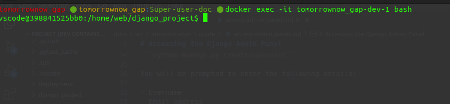

# Accessing the Django Admin Panel

To access the Django admin panel, follow these steps:

1. **Access the Bash of the Django Container**
First, you need to access the bash of the container running Django.

**List Running Containers:**

Use the following command to view the running containers:

```docker ps```

This command displays a list of running containers. Locate and copy the name of the container running the Django image.


2. **Access the Container's Bash:**

Run the following command to open a bash session in the container:

```docker exec -it <Container Name> bash```

Replace <'Container Name'> with the name of your Django container. For example:

```docker exec -it tomorrownow_gap-dev-1 bash```



3. **Create a Django Superuser**

Within the container’s bash session, create a Django superuser by running:

```python manage.py createsuperuser```

You will be prompted to enter the following details:

- Username
- Email address
- Password


4. **Log in to the Django Admin Panel:**

Once the superuser is created, you can access the Django admin panel through the web browser. Open your web browser and navigate to the following URL:

http://yourhost/admin/

For Example:

http://localhost:8000/admin/

Enter your username and password that you set up earlier, then click the 1️⃣ `Login` button, to access the admin panel.


After login you will see the admin panel.


