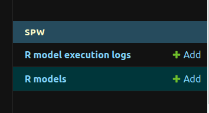
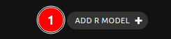
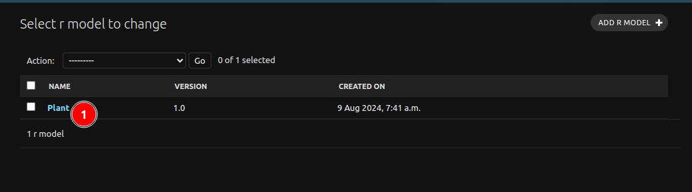
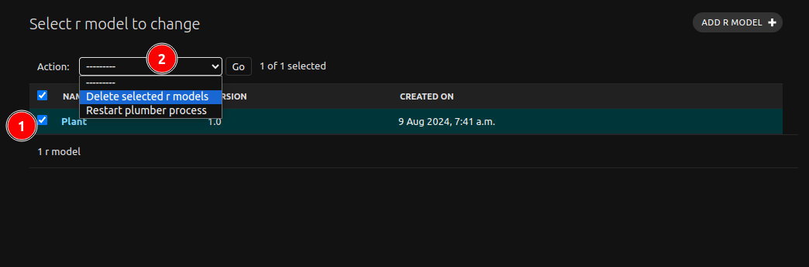

# Managing R Models

As an administrator, you can manage R models on the TOMORROW.NOW platform by following these steps:

## Accessing the R Models Page

Log in to the administration site and navigate to the **SPW** section. Click on the `R Models` link to access the R models page.

## Adding R Models

Click the 1️⃣ `ADD R MODEL` button to add a new R model. Fill in the required information, including the R model's name, description, and code. Review the code requirements and ensure it is secure.

Click one of the three save options:

* **Save and add another**: Save the R model and add another.
* **Save and continue editing**: Save the R model and continue editing.
* **SAVE**: Save the R model and redirect to the **R Models** page.

## Editing R Models

Click on a 1️⃣ R model's name to edit its information. Make changes to its code, description, and permissions as needed.

Click one of the three save options:

* **Save and add another**: Save the R model and add another.
* **Save and continue editing**: Save the R model and continue editing.
* **SAVE**: Save the R model and redirect to the **R Models** page.

## Deleting R Models

Select the R model(s) you want to delete by checking the 1️⃣ `boxes` next to their names. Click the 2️⃣ `Action` dropdown menu and select **Delete selected R model**.

By following these steps, you can effectively manage R models on the TOMORROW.NOW platform.
