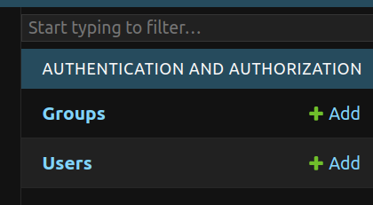
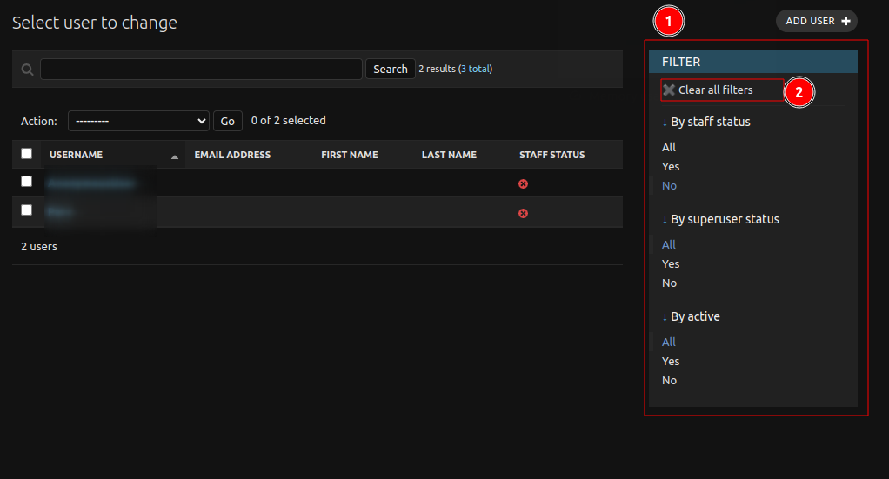
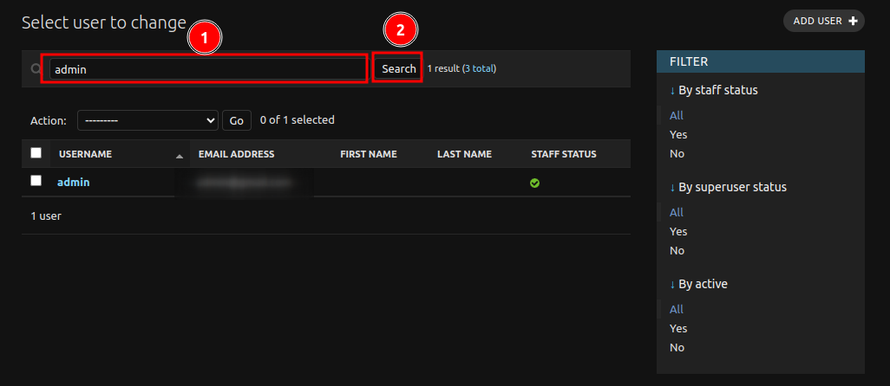

**Managing Users**

As an administrator, you can manage users on the TOMORROW.NOW platform by following these steps:

## Accessing the Users Page

1. Log in to the administration site and navigate to the **AUTHENTICATION AND AUTHORIZATION** section.
2. Click on the **Users** link to access the users page.

## Filtering the User List

On the right-hand side of the page, you will see a 1️⃣ `FILTER` panel. Use the filters to narrow down the list of users. You can apply multiple filters at once. To reset the filters, click the 2️⃣ `Clear all filters` button.

## Searching for Users

1. If you can't find a specific user, use the 1️⃣ `Search` field to search for them. Type a few characters (e.g., letters in the user's name) and click on the 2️⃣ `Search` button. Ensure you clear any applied filters before searching.

## Adding Users

Click the 1️⃣ `ADD USER` button to add a new user. Fill in the required information, including the user's username, password, and profile details. Review the password requirements and generate a secure password. 

Click one of the three save options:

* **Save and add another**: Save the user and add another.
* **Save and continue editing**: Save the user and continue editing.
* **SAVE**: Save the user and redirect to the **Users** page.

## Editing Users

Click on a user's username to edit their information. Make changes to their profile, dates, and permissions as needed.

Click one of the three save options:

* **Save and add another**: Save the user and add another.
* **Save and continue editing**: Save the user and continue editing.
* **SAVE**: Save the user and redirect to the **Users** page.

## Deleting Users

1. Select the user(s) you want to delete by checking the 1️⃣ `boxes` next to their names. Click the 2️⃣ `Action` dropdown menu and select **Delete selected user**.

By following these steps, you can effectively manage users on the TOMORROW.NOW platform.