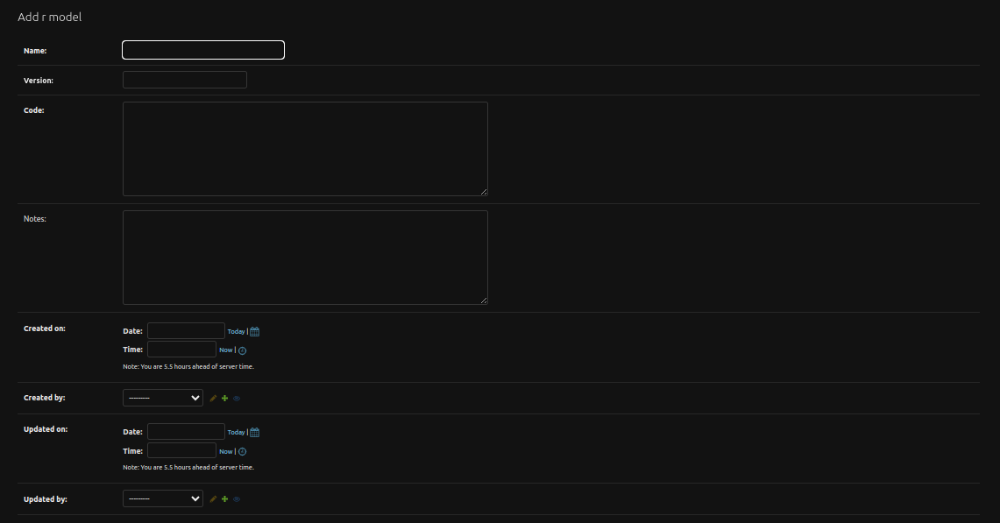
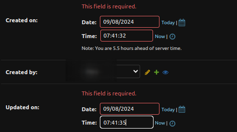
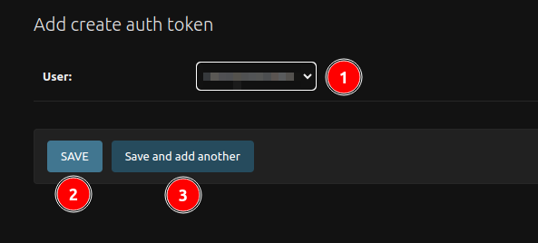

# Add record to the table

## Add User

The administrators will be presented with a form to enter the user's information. Here are the fields to fill in:

1. **Username**: Administrators should enter a unique username for the new user. It should be 150 characters, or less, and may contain only letters, digits, and the characters '@', '.', '+', '-', and '_'.

2. **Password**: Administrators should create a strong password for the user. 

3. **Password Confirmation**: Administrators should re-enter the same password for verification.

4. **Save**: Save the current record, then redirect to the Django Admin Table/record list.

5. **Save and add another**: Save the current record, then redirect to a new page to add a new record.

6. **Save and continue editing**: Save the current record while still showing the current record.

## Add R Model Record

**Form Fields**: Researchers have the ability to create a new R Model record by filling out the form fields. The following fields are available for input:

- **Name**: A unique identifier for the R Model.
- **Version**: The version number of the R Model.
- **Code**: The R code used to produce plant/no plant signals.
- **Notes**: Additional comments or notes about the R Model.

- **Created On**: The date and time the R Model was created. Researchers can select the date from the calendar or set it to the current date by clicking on the `Today` button. The time can be set by clicking on the clock icon or set to the current time by clicking on the `Now` button.

- **Created By**: A dropdown menu listing the available researchers who can create R Models.

- **Updated On:** The date and time the R Model was last updated. Researchers can select the date from the calendar or set it to the current date by clicking on the `Today` button. The time can be set by clicking on the clock icon or set to the current time by clicking on the `Now` button.

- **Updated By:** A dropdown menu listing the available researchers who can update R Models.

Fill all the required fields to save the r model record otherwise it will throw an error.

1. **R MODEL OUTPUTS:** Click on the dropdown to select the type and enter the name into the variable name field.

2. **Save**: This option saves the new R Model record and redirects administrators to the Django Admin Table/record list.

3. **Save and Add Another**: This option saves the new R Model record and redirects administrators to a new page to add another R Model record.

4. **Save and Continue Editing**: Choosing this option saves the new R Model record while still displaying the current record for further editing.

By following these steps, researchers can efficiently create and manage R Model records within the GAP Admin interface.

## Add Auth Token

1. **User:** Select the user from the available users for whom you want to create an authentication token.

2. **Save:** This option saves the new Auth Token record and redirects administrators to the Django Admin Table/record list.

3. **Save and Add Another**: This option saves the new Auth Token record and redirects administrators to a new page to add another Auth Model record.

The process of creating the authentication token is completed.