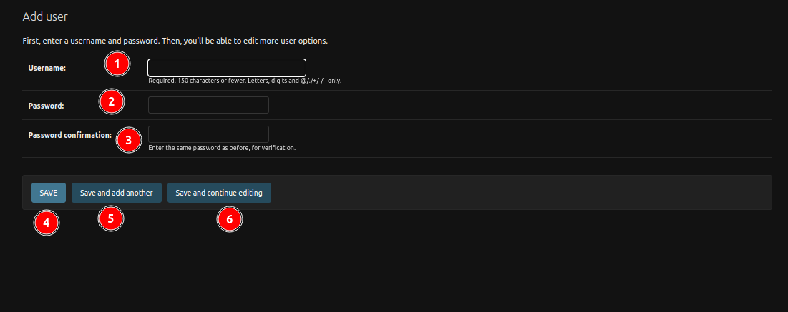

# Add record to the table

## Add User

The administrators will be presented with a form to enter the user's information. Here are the fields to fill in:

1. **Username**: Administrators should enter a unique username for the new user. It should be 150 characters, or less, and may contain only letters, digits, and the characters '@', '.', '+', '-', and '_'.

2. **Password**: Administrators should create a strong password for the user. 

3. **Password Confirmation**: Administrators should re-enter the same password for verification.

4. **Save**: Save the current record, then redirect to the Django Admin Table/record list.

5. **Save and add another**: Save the current record, then redirect to a new page to add a new record.

6. **Save and continue editing**: Save the current record while still showing the current record.
