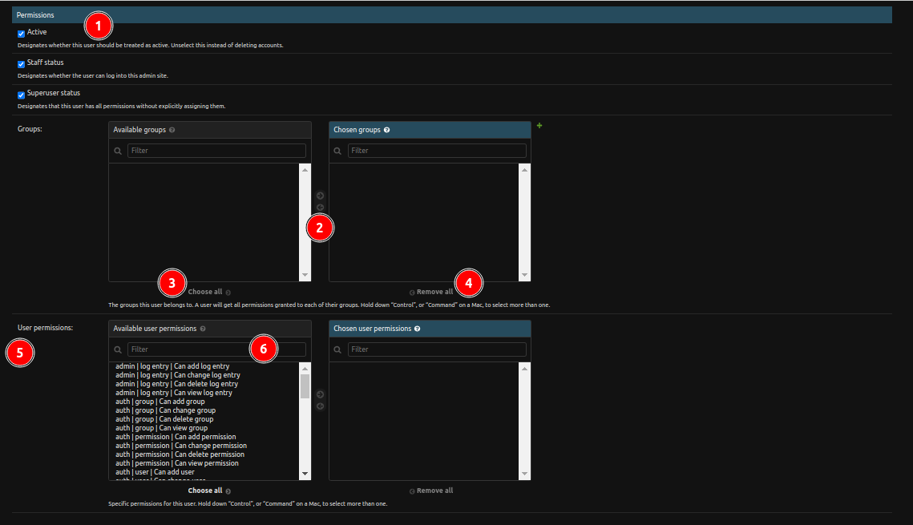

# Change Record

## Change User

1. **History**: Button to view actions applied to the current record.

2. **Change Password**: The administrators can change the user's password by clicking on `this form` link. A popup will open to change the user's password.

    - 

    1. **Change Password Form**: Form to change the user's password.

    2. **Change Password Button**: The administrators can change the user's password by clicking on the `CHANGE PASSWORD` button.

3. **Personal Information:** The administrators can add/update the personal information of the user.

### Change User Permission

1.  **Checkbox**: The administrators can grant permissions to a user by checking the checkbox.

2.  **Arrows**: The administrators can assign or unassign a group to the user by selecting and using these arrows.

3. **Choose All**: The administrators can assign all available groups to the user.

4. **Remove All**: The administrators can unassign all groups from the user.

5. **Permissions**: The administrators can assign or unassign permissions to the user using this table.

6. **Search Permissions**: The administrators can search for permissions using the search functionality.

### Change Dates And User Info

1. **Dates**: The administrators can edit the last login date-time and date joined date-time of a user from this section.

2. **Save**: Save the current record, then redirect to the Django Admin Table/record list.

3. **Save and add another**: Save the current record, then redirect to a new page to add a new record.

4. **Save and continue editing**: Save the current record while still showing the current record.

5. **Delete**: The administrators can delete the user by clicking on this button. The popup will open for the confirmation to delete the user.