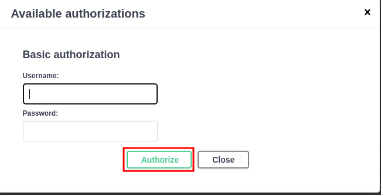
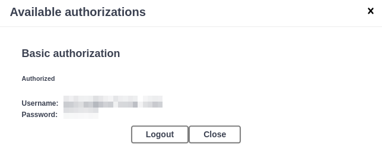
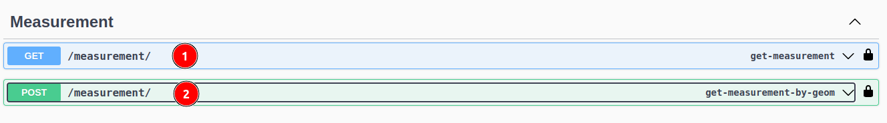
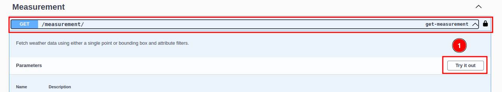
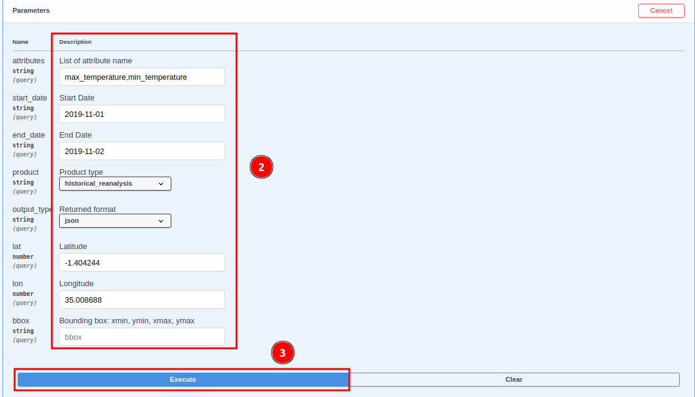

# OSIRIS II Global Access Platform

**Project Overview**

TomorrowNow.org is partnering with the Bill and Melinda Gates Foundation (BMGF) to develop and assess new weather technologies to support the seed breeding ecosystem in East Africa. The "Next-Gen" project focuses on adopting new or next-generation technologies to improve data access and quality.

**Goals**

The project aims to address two key challenges limiting the uptake of weather data in Africa:

1. **Data Access**: Provide curated datasets from top weather data providers, streamlined APIs, and a global access strategy to ensure long-term, low-cost access to weather data.

2. **Data Quality**: Localise forecast models using a network of ground observation stations, apply bias adjustment techniques, and produce analysis-ready datasets using best-practice quality control methods.

**Objectives**

* Improve data quality by measuring and benchmarking data quality and cost across top models for historical climate reanalysis, short-term weather forecasting, and S2S weather forecasting.

* Enhance data access through a global access strategy and partnerships with data providers.

**Impact**

By addressing data access and quality challenges, the project aims to accelerate the adoption of weather intelligence across the smallholder farming ecosystem in East Africa.

TomorrowNow provides access to the data through a RESTful API, available at https://tngap.sta.do.kartoza.com/api/v1/docs/

## GAP Input Data Table

| Product | Provider | Resolution | Source | Version | API product_type |
|---------|----------|------------|--------|---------|------------------|
| **Historical Data** |
| Climate Reanalysis | Tomorrow.io | 4km² | Tomorrow.io CBAM 1F enhanced bias-corrected reanalysis | 2012-2023 | historical_reanalysis |
| | Tomorrow.io | 4km² | Tomorrow.io Historical Reanalysis (API) | | |
| Ground Observation Data | TAHMO weather stations | 300+ stations across East Africa | TAHMO Gap Filled Data (csv) | 2018-2024 | observations |
| | Arable weather stations | 300+ stations across East Africa | Arable (API) | | |
| **Weather Forecasts** |
| Short-term Deterministic Weather Forecast | Tomorrow.io | 4km² | Tomorrow.io CBAM satellite enhanced short-term weather forecasts | | shortterm_forecast |
| Seasonal Probabilistic Weather Forecast | Salient | 9km² | Salient (API) | v9 | seasonal_forecast |
| |

## Attributes Table

Certainly. Here's the table with the "Source attribute name" column removed:

| Product | Name | Description | Unit | API attribute name |
|---------|------|-------------|------|---------------------|
| **Seasonal Forecast** |
| Seasonal Forecast | Temperature | | °C | temperature |
| Seasonal Forecast | Temperature Climatology | | °C | temperature_clim |
| Seasonal Forecast | Temperature Anomaly | | °C | temperature_anom |
| Seasonal Forecast | Precipitation | | mm day-1 | precipitation |
| Seasonal Forecast | Precipitation Anomaly | | mm day-1 | precipitation_anom |
| Seasonal Forecast | Precipitation Climatology | | mm day-1 | precipitation_clim |
| Seasonal Forecast | Minimum Temperature | | °C | min_temperature |
| Seasonal Forecast | Minimum Temperature Climatology | | °C | min_temperature_clim |
| Seasonal Forecast | Minimum Temperature Anomaly | | °C | min_temperature_anom |
| Seasonal Forecast | Maximum Temperature | | °C | max_temperature |
| Seasonal Forecast | Maximum Temperature Climatology | | °C | max_temperature_clim |
| Seasonal Forecast | Maximum Temperature Anomaly | | °C | max_temperature_anom |
| Seasonal Forecast | Relative Humidity | | % | relative_humidty |
| Seasonal Forecast | Relative Humidity Climatology | | % | relative_humidty_clim |
| Seasonal Forecast | Relative Humidity Anomaly | | % | relative_humidty_anom |
| Seasonal Forecast | Downward Solar Radiation | | kWh m-2 day-1 | solar_radiation |
| Seasonal Forecast | Downward Solar Radiation Climatology | | kWh m-2 day-1 | solar_radiation_clim |
| Seasonal Forecast | Downward Solar Radiation Anomaly | | kWh m-2 day-1 | solar_radiation_anom |
| Seasonal Forecast | Wind Speed Climatology | | m/s | wind_speed |
| Seasonal Forecast | Wind Speed Climatology | | m/s | wind_speed_clim |
| Seasonal Forecast | Wind Speed Climatology | | m/s | wind_speed_anom |
| **Historical Reanalysis** |
| Historical Reanalysis | Min Total Temperature | Minimum temperature (0000:2300) | °C | min_temperature |
| Historical Reanalysis | Min Day Temperature | Minimum day-time temperature (0600:1800) | °C | min_day_temperature |
| Historical Reanalysis | Total Rainfall | Total rainfall (0000:2300) | mm | total_rainfall |
| Historical Reanalysis | Max Day Temperature | Maximum day-time temperature (0600:1800) | °C | max_day_temperature |
| Historical Reanalysis | Min Night Temperature | Minimum night-time temperature (1900:0500) | °C | min_night_temperature |
| Historical Reanalysis | Total Solar Irradiance | Total solar irradiance reaching the surface (0000:2300) | MJ/sqm | total_solar_irradiance |
| Historical Reanalysis | Average Solar Irradiance | Average hourly solar irradiance reaching the surface (0600:1800) | MJ/sqm | average_solar_irradiance |
| Historical Reanalysis | Max Night Temperature | Maximum night-time temperature (1900:0500) | °C | max_night_temperature |
| Historical Reanalysis | Max Total Temperature | Maximum temperature (0000:2300) | °C | max_temperature |
| Historical Reanalysis | Total Evapotranspiration Flux | Total Evapotranspiration flux with respect to grass cover (0000:2300) | mm | total_evapotranspiration_flux |
| **Observation** |
| Observation | Precipitation | | mm/day | precipitation |
| Observation | Solar radiation | | Wh/m2 | solar_radiation |
| Observation | Relative Humidity Max | | % | max_relative_humidity |
| Observation | Relative Humidity Min | | % | min_relative_humidity |
| Observation | Air Temperature Average | | °C | average_air_temperature |
| Observation | Air Temperature Max | | °C | max_air_temperature |
| Observation | Air Temperature Min | | °C | min_air_temperature |
| **WIP** |
| Short-term Forecast | Min Total Temperature | | °C | min_total_temperature |
| Short-term Forecast | Min Day Temperature | | °C | min_day_temperature |
| Short-term Forecast | Total Rainfall | | mm | total_rainfall |
| Short-term Forecast | Max Day Temperature | | °C | max_day_temperature |
| Short-term Forecast | Min Night Temperature | | °C | min_night_temperature |
| Short-term Forecast | Total Solar Irradiance | | MJ/sqm | total_solar_irradiance |
| Short-term Forecast | Average Solar Irradiance | | MJ/sqm | average_solar_irradiance |
| Short-term Forecast | Max Night Temperature | | °C | max_night_temperature |
| Short-term Forecast | Max Total Temperature | | °C | max_total_temperature |
| Short-term Forecast | Total Evapotranspiration Flux | | mm | total_evapotranspiration_flux |
| |

In order to use the API, the user must be authenticated and must have authorisation to access the data.

Let's see how to use the API and what sequence of API calls can lead us to get data for analysis.

Once you open the above link the Swagger will open. Click on the 1️⃣ `Authorize` button, to open the authorisation form.

To authorize, please enter your `Username` and `Password` Once you have entered your credentials, click the `Authorize` button to complete the authorisation process.

Click on the close button or cross button to close the authorisation form.

**Examples of Usage of the OSIRIS II API**

Please note that the data in the examples provided below DO NOT reflect the actual data in TomorrowNow.

## Accessing the OSIRIS II API

To use the API click on the API either 1️⃣ GET or 2️⃣ POST API you want to use.

For example GET API:

Click on the GET API it will show the attribute to enter to get the data. Click on the 1️⃣ `Try it out` button, to fill the detailed in the 2️⃣ available fields. After filling the details click on the 3️⃣ `Exicute` button, to run the API.

**Example of response:**

**Example of Python Code To Access the API**

