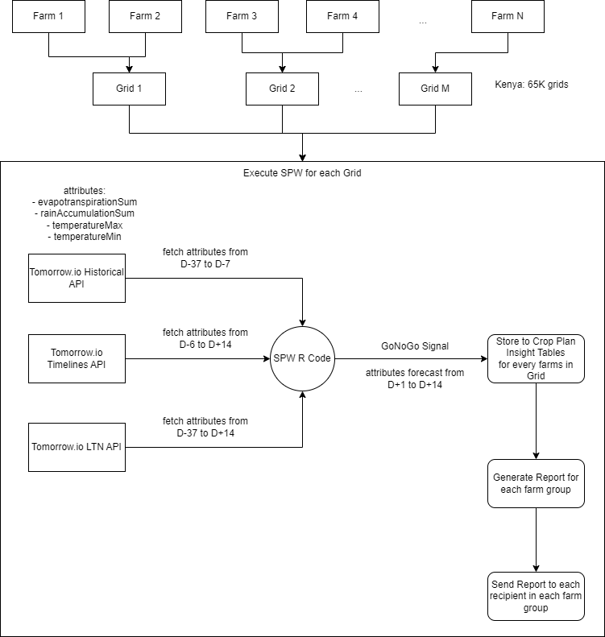

# Architecture 

## Architecture diagram


## Data flow diagram


## Data ingestors

### CBAM historical reanalysis


Zarr structure for CBAM dataset:
```
<xarray.Dataset> Size: 160GB
Dimensions:                        (date: 4384, lat: 1205, lon: 841)
Coordinates:
  * date                           (date) datetime64[ns] 35kB 2012-01-01 ... ...
  * lat                            (lat) float64 10kB -27.0 -26.97 ... 16.03
  * lon                            (lon) float64 7kB 21.78 21.82 ... 51.99 52.03
Data variables:
    average_solar_irradiance       (date, lat, lon) float32 18GB dask.array<chunksize=(90, 300, 300), meta=np.ndarray>
    max_day_temperature            (date, lat, lon) float32 18GB dask.array<chunksize=(90, 300, 300), meta=np.ndarray>
    max_night_temperature          (date, lat, lon) float32 18GB dask.array<chunksize=(90, 300, 300), meta=np.ndarray>
    max_total_temperature          (date, lat, lon) float32 18GB dask.array<chunksize=(90, 300, 300), meta=np.ndarray>
    min_day_temperature            (date, lat, lon) float32 18GB dask.array<chunksize=(90, 300, 300), meta=np.ndarray>
    min_night_temperature          (date, lat, lon) float32 18GB dask.array<chunksize=(90, 300, 300), meta=np.ndarray>
    min_total_temperature          (date, lat, lon) float32 18GB dask.array<chunksize=(90, 300, 300), meta=np.ndarray>
    total_evapotranspiration_flux  (date, lat, lon) float32 18GB dask.array<chunksize=(90, 300, 300), meta=np.ndarray>
    total_solar_irradiance         (date, lat, lon) float32 18GB dask.array<chunksize=(90, 300, 300), meta=np.ndarray>
```

### Salient seasonal forecast


Zarr structure for Salient dataset:
```
<xarray.Dataset> Size: 11GB
Dimensions:           (ensemble: 50, forecast_day_idx: 91, forecast_date: 2,
                       lat: 174, lon: 123)
Coordinates:
    analog            (ensemble, forecast_day_idx) datetime64[ns] 36kB dask.array<chunksize=(50, 20), meta=np.ndarray>
  * ensemble          (ensemble) int64 400B 0 1 2 3 4 5 6 ... 44 45 46 47 48 49
  * forecast_date     (forecast_date) datetime64[ns] 16B 2024-09-04 2024-09-09
  * forecast_day_idx  (forecast_day_idx) int64 728B 0 1 2 3 4 ... 86 87 88 89 90
  * lat               (lat) float64 1kB -27.12 -26.88 -26.62 ... 15.88 16.12
  * lon               (lon) float64 984B 21.63 21.88 22.13 ... 51.63 51.88 52.13
Data variables: (12/21)
    precip            (forecast_date, ensemble, forecast_day_idx, lat, lon) float32 779MB dask.array<chunksize=(2, 50, 20, 20, 20), meta=np.ndarray>
    precip_anom       (forecast_date, ensemble, forecast_day_idx, lat, lon) float32 779MB dask.array<chunksize=(2, 50, 20, 20, 20), meta=np.ndarray>
    precip_clim       (forecast_date, forecast_day_idx, lat, lon) float32 16MB dask.array<chunksize=(2, 20, 20, 20), meta=np.ndarray>
    rh                (forecast_date, ensemble, forecast_day_idx, lat, lon) float32 779MB dask.array<chunksize=(2, 50, 20, 20, 20), meta=np.ndarray>
    rh_anom           (forecast_date, ensemble, forecast_day_idx, lat, lon) float32 779MB dask.array<chunksize=(2, 50, 20, 20, 20), meta=np.ndarray>
    rh_clim           (forecast_date, forecast_day_idx, lat, lon) float32 16MB dask.array<chunksize=(2, 20, 20, 20), meta=np.ndarray>
    ...                ...
    tsi               (forecast_date, ensemble, forecast_day_idx, lat, lon) float32 779MB dask.array<chunksize=(2, 50, 20, 20, 20), meta=np.ndarray>
    tsi_anom          (forecast_date, ensemble, forecast_day_idx, lat, lon) float32 779MB dask.array<chunksize=(2, 50, 20, 20, 20), meta=np.ndarray>
    tsi_clim          (forecast_date, forecast_day_idx, lat, lon) float32 16MB dask.array<chunksize=(2, 20, 20, 20), meta=np.ndarray>
    wspd              (forecast_date, ensemble, forecast_day_idx, lat, lon) float32 779MB dask.array<chunksize=(2, 50, 20, 20, 20), meta=np.ndarray>
    wspd_anom         (forecast_date, ensemble, forecast_day_idx, lat, lon) float32 779MB dask.array<chunksize=(2, 50, 20, 20, 20), meta=np.ndarray>
    wspd_clim         (forecast_date, forecast_day_idx, lat, lon) float32 16MB dask.array<chunksize=(2, 20, 20, 20), meta=np.ndarray>
```

### Tomorrow.io short-term forecast


Zarr structure for Tomorrow.io dataset:
```
<xarray.Dataset> Size: - GB
Dimensions:           (forecast_date: 2, forecast_day_idx: 15, lat: 174, lon: 123)
Coordinates:
  * forecast_date     (forecast_date) datetime64[ns] 16B 2024-09-04 2024-09-05
  * forecast_day_idx  (forecast_day_idx) int64 728B 0 1 2 3 4 ... 11 12 13 14
  * lat               (lat) float64 1kB -27.12 -26.88 -26.62 ... 15.88 16.12
  * lon               (lon) float64 984B 21.63 21.88 22.13 ... 51.63 51.88 52.13
Data variables: (12/21)
    total_rainfall                   (forecast_date, forecast_day_idx, lat, lon) float32 -MB dask.array<chunksize=(15, 15, 150, 110), meta=np.ndarray>
    total_evapotranspiration_flux    (forecast_date, forecast_day_idx, lat, lon) float32 -MB dask.array<chunksize=(15, 15, 150, 110), meta=np.ndarray>
    max_total_temperature            (forecast_date, forecast_day_idx, lat, lon) float32 -MB dask.array<chunksize=(15, 15, 150, 110), meta=np.ndarray>
    min_total_temperature            (forecast_date, forecast_day_idx, lat, lon) float32 -MB dask.array<chunksize=(15, 15, 150, 110), meta=np.ndarray>
    precipitation_probability        (forecast_date, forecast_day_idx, lat, lon) float32 -MB dask.array<chunksize=(15, 15, 150, 110), meta=np.ndarray>
    humidity_maximum                 (forecast_date, forecast_day_idx, lat, lon) float32 -MB dask.array<chunksize=(15, 15, 150, 110), meta=np.ndarray>
    humidity_minimum                 (forecast_date, forecast_day_idx, lat, lon) float32 -MB dask.array<chunksize=(15, 15, 150, 110), meta=np.ndarray>
    wind_speed_avg                   (forecast_date, forecast_day_idx, lat, lon) float32 -MB dask.array<chunksize=(15, 15, 150, 110), meta=np.ndarray>
```

### Tahmo ground observations


### Arable ground observations


## GAP Modules

### SPW data flow diagram



